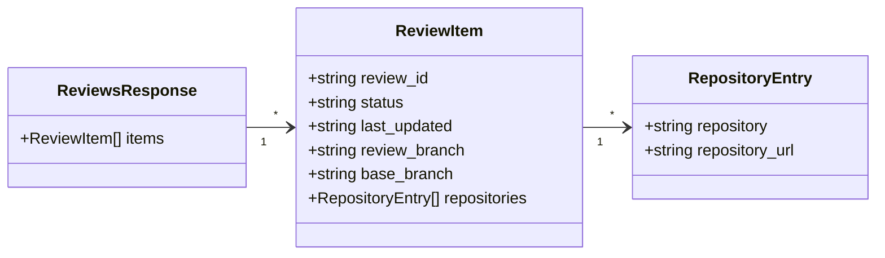
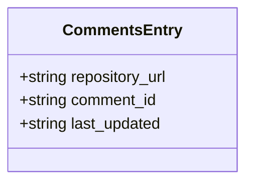
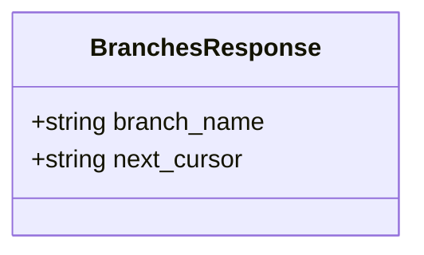
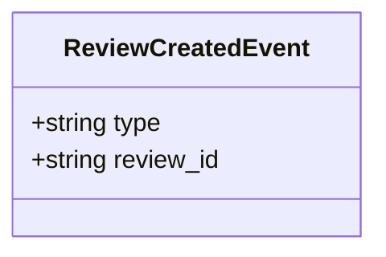
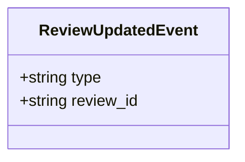
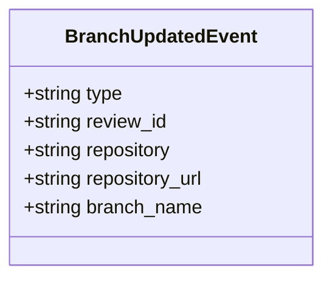
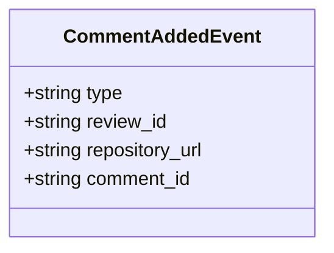
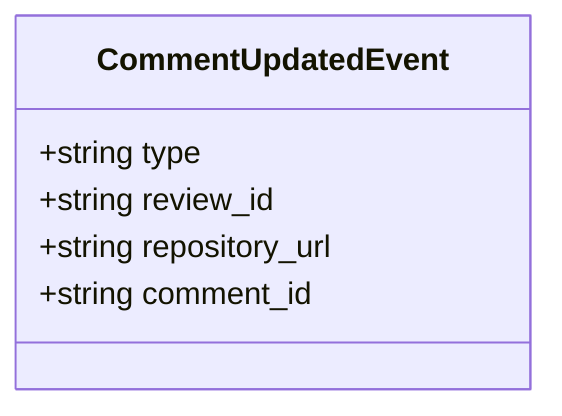
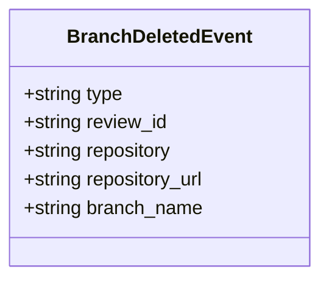

# Indexer ↔ Client Interface

Defines the internal communication interface between the Central Indexer and the Review Tool client. This is an internal interface — not a public API.

---

## Overview

The client communicates with the indexer over two channels:

| Channel | Direction | Purpose |
|---|---|---|
| REST | Client → Indexer | Initial data load on connect |
| SSE | Indexer → Client | Live incremental updates |

The indexer is intentionally a **thin routing layer**. Event payloads carry only the minimum needed to identify what changed — the client fetches full content from git directly.

---

## REST Endpoints (Connect Sequence)

Called before opening the SSE stream. Provides the initial state the client needs to render.

### `GET /reviews`

Returns the current review index. Client uses this to populate the review list on startup.

**Query Parameters**

| Parameter | Type | Required | Description |
|---|---|---|---|
| `since` | ISO 8601 timestamp | No | Only return reviews updated after this time. Client controls the initial history window. |
| `status` | `OPEN` \| `IN_PROGRESS` \| `CHANGES_REQUESTED` \| `COMPLETED` \| `CANCELLED` | No | Filter by status (single value or list). Defaults to all. |

**Response**

The response includes routing keys for each review plus the set of repositories and branches associated with that review. Each repository entry includes a `repository_url` (the canonical git URL for the repo) so the client can fetch full review content from the correct remote without additional lookups.



> The client groups `review_id`s by repository and fetches full review content (title, author, branch, reviewers, comments) from git via `git cat-file --batch`. The indexer provides `repository_url` so the client can target the correct remote. The indexer stores routing keys only.

---

### `GET /reviews/{reviewId}/comments`

Returns the list of comment routing entries for a review. The client uses this on initial load to discover which `comment_id`s exist and in which repository clone to read them from. Comment content is always read from git, not from the indexer.

See [`comments.md`](../comments.md) for full design rationale.

**Auth:** Bearer token required.

**Response**



Response is an array of `CommentsEntry` — one entry per comment. The client uses `repository_url` + `comment_id` to read the three sub-streams from the correct clone: `reviews/{reviewId}/comments/{comment_id}/metadata`, `.../text`, and `.../status` on the `kalynx-reviews` orphan branch.

---

### `GET /branches`

Simple branch listing for typeahead and discovery. Keep this endpoint branch-focused and lightweight.

Query parameters:

- `q` (string, optional) — branch name or prefix for typeahead.
- `repository` (string, optional) — owner/repo-name to restrict results.
- `limit` (integer, optional) — default 50, max 500.
- `cursor` (string, optional) — opaque cursor for pagination.

Response (200):



Notes:
- This endpoint returns branch records only. If the client needs review routing keys, use `GET /reviews` (which includes repositories/branches) or add a small dedicated mapping endpoint later.
- Keep limits small for typeahead to protect performance.

---

### `GET /events/stream`

Opens the SSE connection. Must be called after the REST endpoints have loaded.

**Headers**

| Header | Description |
|---|---|
| `Last-Event-ID` | If provided, the indexer replays any buffered events above this sequence number. Used on reconnect. |

---

## SSE Event Format

```
id: <sequence-number>
event: <event-type>
data: <json-payload>

```

---

## Event Types

### `review.created`

A new review has been created in a tracked repository.

```
event: review.created
```



**Client action**: Fetch full review from git, insert into review list at correct recency position.

---

### `review.updated`

A review's status has changed, or its repository associations have changed.

```
event: review.updated
```



**Client action**: Re-fetch review metadata from git. Re-sort by `last_updated` — the review floats to its correct position. This is how previously-loaded old reviews surface when they become active again.

---

### `branch.updated`

New commits have been pushed to a branch that is under review.

```
event: branch.updated
```



**Client action**: If this review is open in the viewer, fetch updated diff from git using `head_commit`.

> `head_commit` is included in the payload so the client can immediately target the correct commit without an extra lookup.

---

### `comment.added`

One or more new comments (or replies) have been written to a review.

```
event: comment.added
```



**Client action**: Read `reviews/{reviewId}/comments/{comment_id}/metadata`, `.../text`, and `.../status` from the `kalynx-reviews` orphan branch of the clone at `repository_url`. Insert or update that comment in the panel.

---

### `comment.updated`

An existing comment's resolution state has changed.

```
event: comment.updated
```



**Client action**: Read `reviews/{reviewId}/comments/{comment_id}/status` from the `kalynx-reviews` orphan branch of the clone at `repository_url`. Refresh that comment's resolved state in the panel.

---

### `branch.deleted`

A branch under review has been deleted from the repository.

```
event: branch.deleted
```



**Client action**: Surface a warning on the open review that the branch no longer exists.

---

## Client Connect Sequence

```
1. GET /reviews?since=<timestamp>&status=<status-filter>
   → Retrieve a compact snapshot from `reviews_index` (used to populate the list)
   → Group `review_id`s by repository and fetch full review content from git per repository

2. GET /branches?q=<branch_prefix>
   → Lightweight global branch lookup for typeahead and discovery (branch-only results)

3. GET /events/stream
   → Pass `Last-Event-ID` if reconnecting; receive small signals from this point forward
   → Client filters, re-fetches as needed from git, and re-sorts locally
```

---

## Reconnect Behaviour

On SSE disconnect, the client:

1. Re-calls `GET /reviews` to catch any missed updates
2. Reconnects `GET /events/stream` with `Last-Event-ID`
3. Indexer replays buffered events above that sequence number

---

## Design Principles

- **Signal, not payload** — Events identify *what* changed. The client fetches content after receiving a signal.
- **Route signals to interested clients** — The indexer publishes small events keyed by repository/review and uses per-repository publishers so only subscribed clients are woken.
- **Terminal reviews are quiet** — The indexer does not emit routine updates for reviews in terminal statuses (`COMPLETED`, `CANCELLED`) unless a meaningful change occurs.
- **No client-to-indexer messages** — The channel is unidirectional. Clients write review data directly to git.
- **Comments route via indexer, read from git** — `GET /reviews/{reviewId}/comments` returns routing keys only (`repository_url`, `comment_id`). Comment content is always read from the `kalynx-reviews` orphan branch clone — never stored in the indexer DB. The indexer tracks which `comment_id`s exist and where, so the client can target the correct clone without scanning all repositories. See [`comments.md`](../comments.md).

